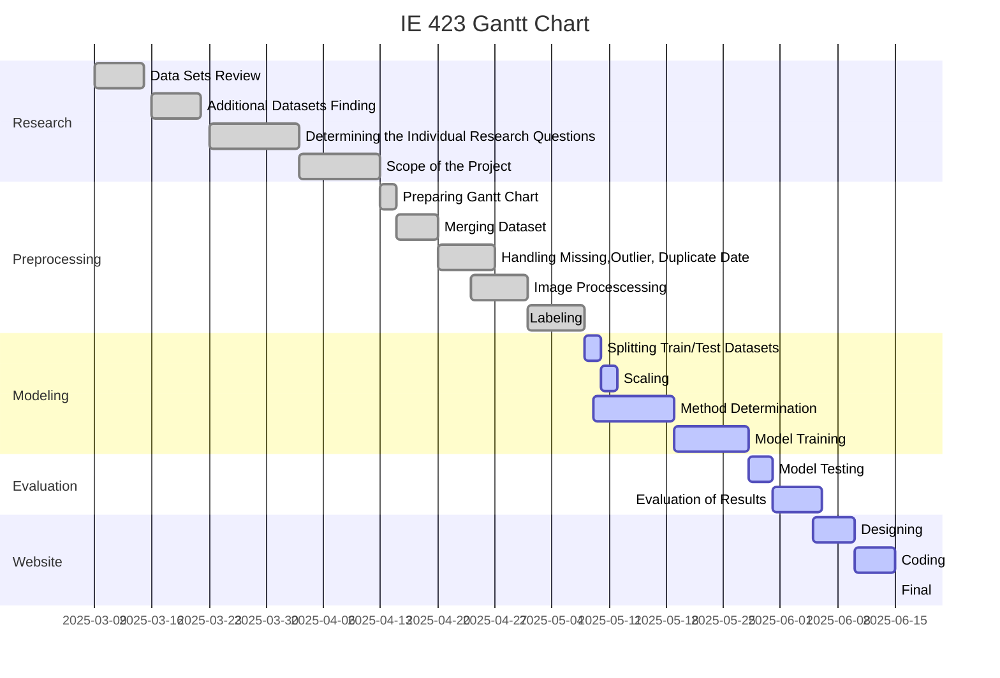

```mermaid
gantt
    dateFormat  YYYY-MM-DD
    title IE 423 Gantt Chart

    section Research
    Data Sets Review                              :done,    r1, 2025-03-09, 2025-03-15
    Additional Datasets Finding                   :done,    r2, 2025-03-16, 2025-03-22
    Determining the Individual Research Questions :done,    r3, 2025-03-23, 2025-04-03
    Scope of the Project                          :done,    r4, 2025-04-03, 2025-04-13

    section Preprocessing
    Preparing Gantt Chart                         :done,    p1, 2025-04-13, 2025-04-15
    Merging Dataset                               :done,    p2, 2025-04-15, 2025-04-20
    Handling Missing,Outlier, Duplicate Date      :done,    p3, 2025-04-20, 2025-04-27
    Image Procescessing                           :done,    p4, 2025-04-24, 2025-05-01
    Labeling                                      :done,    p5, 2025-05-01, 2025-05-08

    section Modeling
    Splitting Train/Test Datasets                 :active,  m1, 2025-05-08, 2025-05-10
    Scaling                                       :active,  m2, 2025-05-10, 2025-05-12
    Method Determination                          :active,  m3, 2025-05-09, 2025-05-19
    Model Training                                :active,  m4, 2025-05-19, 2025-05-28

    section Evaluation
    Model Testing                                 :active,  e1, 2025-05-28, 2025-05-31
    Evaluation of Results                         :active,  e2, 2025-05-31, 2025-06-06

    section Website
    Designing                                     :active,  w1, 2025-06-05, 2025-06-10
    Coding                                        :active,  w2, 2025-06-10, 2025-06-15
    Final                                         :active,  w3, 2025-06-15, 
```
