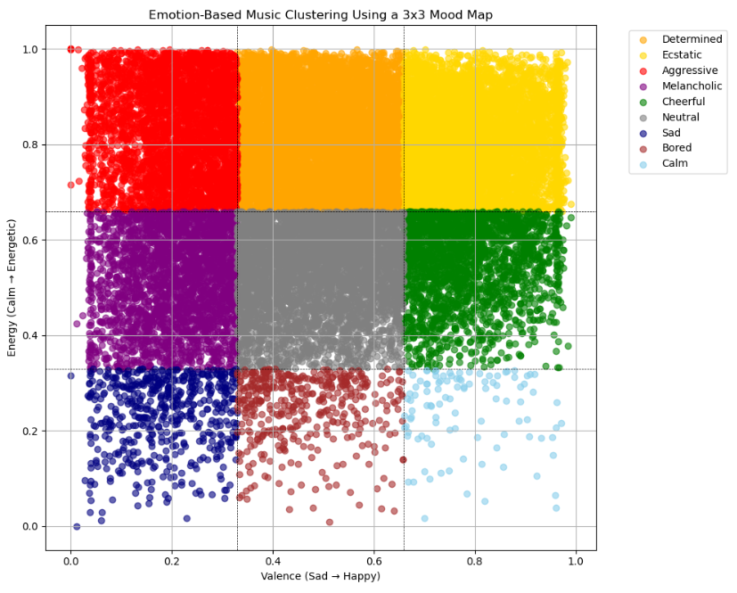

# Mood Prediction of Songs

122203088 Belinay Keleş  
121203034 Sude Şintürk  
121203079 Yeliz Avcı  
120203034 Sevgi Gündoğdu  

## 1.Scope of the Project

This project aims to predict the emotional states conveyed by songs using their multidimensional features. In addition to spotify dataset, album cover images and song lyrics were used. The main goal of the project is to classify the emotion a song conveys by holistically analyzing audio-based (valence and energy), visual (album cover), and textual (lyrics) features using machine learning techniques. The project is based on the two-dimensional energy-valence matrix, commonly used in psychology models such as Thayer's Mood Model, to define emotions. Songs are categorized into emotional clusters such as joyful, sad, energetic, and anxious. The core focuses of the project are:  

-Performing textual analysis (NLP) on song lyrics to identify emotional expressions and integrate them into the model,  
-Using visual processing techniques to analyze album cover features and utilize them in emotion prediction,  
-Determining the emotional positioning of songs on the mood map using audio-based features (valence and energy) retrieved from Spotify.  

Ultimately, this project aims to build an innovative, machine learning-enhanced emotion prediction system based on a multimodal approach and use it to generate emotion-based playlists for users.  

 
## 2.Research Questions

How accurately can a song's emotion be predicted based on its energy and valence values, and how reliably can playlists be generated based on these predictions?

To what extent do the visual features of album covers (e.g., color, contrast, visual density) and song lyrics align with the predicted emotional state?

Among various machine learning models (e.g., XGBoost, Random Forest, SVM), which algorithm performs best in predicting a song’s emotion?

## 3.Preprocessing Steps

### 3.1.Libraries
In this project, the libraries OpenCV,  pandas, matploblib, seaborn, Pillow, io,  tqdm, NumPy, selenium, Spotipy, os, AutoTokenizer, google.generativeai, SentenceTransformer and scikit-learn were used.
In the parts where data is generated, the additional libraries selenium, time, requests, and beautifulsoup4 were used.

### 3.2.Dataset
This dataset contains detailed audio features and metadata for 30,000 songs collected via the Spotify API. Each track includes attributes such as danceability, energy, loudness, speechiness, acousticness, instrumentalness, valence, tempo, and popularity. In addition to these, the dataset also includes identity-related features such as the playlists the songs appear in.

To obtain the album covers of the songs in the original dataset, a Spotify Developer account was first created and Spotify API credentials were obtained. Then, using Python, the spotify library was imported to automate the data retrieval process. Since downloading album covers directly would be time-consuming, album URLs were first collected using the track_album_id field. A total of 32,816 URLs were retrieved, and 22,533 unique album covers were automatically downloaded using the os, requests, and tqdm libraries. These album covers were stored in the album_covers directory.

Since song lyrics are expected to be an important feature in conveying emotional content, this information was incorporated into the dataset. To retrieve the lyrics, an automation script was developed in Python using the Selenium library. The web scraping process was applied on the website genius.com . In the first stage of the script, the track_name and track_artist values from the dataset were programmatically inserted into the site's search bar. Then, the link of the top result (first matching song) was extracted from the search results. After collecting all relevant URLs, a second script was used to navigate to each song page and extract the corresponding lyrics. 

The lyrics and URLs were parsed by taking into account the HTML structure of each Genius song page. Additionally, tracks for which a dedicated lyrics page had not yet been created were automatically skipped during scraping.

In the songs_with_lyrics.csv file, missing (NaN) and duplicate song entries were removed. The number of tokens in each lyric was calculated using the AutoTokenizer library and saved in a new column named lyrics_token_count. An analysis with the describe() function showed that the median token count was 570.

Before proceeding with embedding, we decided to summarize the lyrics because the selected model, DistilBERT-based “all-MiniLM-L6-v2”, supports a maximum of 512 tokens. For this, a Google Cloud account was created, a Gemini API key was obtained, the google.generativeai library was installed, and the “gemini-1.5-flash” model was used.

The summarization prompt used was as follows:

“Summarize the following song lyrics in 2-3 sentences. “

“Use the perspective and voice of the lyrics themselves (do not refer to the song as “the song says” or “the singer feels”). “

“Capture the main theme, message, or emotional tone directly from the lyrics. “

“Do not include any outside interpretation or third-person phrasing. “

“If the original lyrics are in a non-English language, still summarize them **only in English**. “

“Use **only English words** in the summary — do not include any non-English words, names, or expressions.”

“Keep the tone natural and expressive, aligned with the original emotion.”

Below are sample tracks included to demonstrate the model’s summarization performance on complex or multilingual lyrics.

Example-1

Aerials- System of a Down

Life is a waterfall

We're one in the river and one again after the fall

Swimming through the void, we hear the word

We lose ourselves, but we find it all

'Cause we are the ones that wanna play

Always wanna go, but you never wanna stay

And we are the ones that wanna choose

Always wanna play, but you never wanna lose

Aerials in the sky

When you lose small mind, you free your life

Life is a waterfall

We drink from the river, then we turn around and put up our walls

Swimming through the void, we hear the word

We lose ourselves, but we find it all

'Cause we are the ones that wanna play

Always wanna go, but you never wanna stay

And we are the ones that wanna choose

Always wanna play, but you never wanna lose, oh

Aerials in the sky

When you lose small mind, you free your life

Aerials, so up high

When you free your eyes, eternal prize

Aerials in the sky

When you lose small mind, you free your life

Aerials, so up high

When you free your eyes, eternal prize

Summary

Life's a continuous cycle, a fall and a rise, a journey of losing and finding ourselves.  We crave freedom and the thrill of playing, yet fear losing control. Letting go of limitations unlocks a greater, eternal reward.

“Aerials” is a complex and metaphorical song, rich in symbolic language. The model successfully extracts its core theme—how perception and cyclical change define human experience—and expresses it in a concise and meaningful way.
“Life's a continuous cycle, a fall and a rise, a journey of losing and finding ourselves.”
This summary reflects the main philosophical theme of the song in a brief and meaningful way:
The phrase “fall and rise” captures the cyclical nature of life.
Instead of using a third-person narration, the model directly conveys the song’s core theme.
Moreover, while preserving the abstract tone of the original lyrics, the summary sentence remains fluent, coherent, and rich in meaning.

Example-2

Måndagsbarn – Veronica Maggio

Jag blev ett måndagsbarn

Hela livet blev en helg

Mmm, nu ere måndag snart

O jag lever för ikväll, 

Sena nätter, tomma glas....(continue)

-English Version-

I became a Monday’s child

My whole life turned into a weekend

Mmm, now it’s almost Monday

But I live for tonight 

Late nights, empty glasses

500 kronor postpones the problem for a while (for the moment)

But I think soon...

Everyone will have had enough of me

What have you done of yourself, for yourself, to yourself?

The situation is so messed up

For you, it’s always the weekend

But the weekend has to end

It’s packed on a Saturday at five

I always long to get away, but never home

I should, ought to deal with it later—what’s going to become of me?

There are days like today with hopeless mornings

That’s when I wake up a wreck

And I realize everyone has… had enough of me

What have you done of yourself, for yourself, to yourself?

The situation is so messed up

For you, it’s always the weekend

But the weekend has to end

I became a Monday’s child

My whole life turned into a weekend

It’s almost Monday

But I live for tonight

Born on a Saturday, mom called me a disco girl

So on a Saturday, you know where to find me

Born on a Saturday, everyone calls me the disco girl

And mom’s wondering…

What have you done of yourself, for yourself, to yourself?

The situation is so messed up

What have you done, Ve-ronica, to yourself?

The weekend has to end... (oh!)

(You’re a Monday’s child

You’re a Monday’s child)

Summary

My life's one endless weekend, fueled by late nights and empty glasses, but the party's almost over.  People are tired of my reckless behavior; I'm lost, and this sick situation has to end.  I'm a Friday child, always searching for the next party, but even that can't last forever.

This song is written in Swedish and is woven with local cultural elements, metaphors from everyday life, and a slightly melancholic narrative. The title translates to “Monday’s Child,” and throughout the song, this concept is blended with reflections on the flow of life and personal freedom.
For us, summarizing the meaning of such a song in a different language is often challenging. However, we observed that the model handled this complexity quite successfully.
“My life's one endless weekend, fueled by late nights and empty glasses, but the party's almost over.”
The model captures the tone and mood of the song, conveying the individual’s free-spirited, unplanned lifestyle in a simple yet powerful way.
The emotional atmosphere of the original is preserved in the summary—evoking a sense of recklessness, youth, and freedom.
It also stands out as a technically strong example, demonstrating how the model, while working solely with English words, was still able to accurately extract the meaning conveyed in Swedish.

The aim during summarization was to remain true to the song’s original voice, capturing its message or emotion without adding external interpretation or commentary.

The final version of the dataset was saved in the file titled “lyrics_summarized.csv”.

### 3.3.Process
Data Loading and Initial Cleaning  

The primary dataset, spotify_songs.csv, was loaded and all rows containing missing values were removed using the dropna() function. The describe() function was then used to examine the feature distributions and value ranges. It was observed that the loudness feature included values outside the expected range of -60 to 0, which were identified as outliers and subsequently removed. Additionally, duplicate entries based on the track_id column were detected and eliminated to ensure data integrity.  

Mood Label Assignment Using a 3x3 Grid  

According to Lata (2024), Spotify songs were classified based on emotions using Robert Thayer’s traditional two-dimensional mood model, which is built on the dimensions of energy and valence. While studies typically employ a 2x2 (four-cluster) structure, our project divided the valence (emotional positivity) and energy axes into three equal intervals, resulting in a 3x3 grid that enables a more detailed representation of emotions. As a result, nine distinct mood clusters were obtained. This approach preserves the simplicity and clarity of Thayer’s model while allowing for a more nuanced emotional mapping. Cluster labeling was inspired by the core mood states defined in Thayer’s model, such as Exuberance, Anxiety, Contentment, and Depression. This method provides a strong foundation for the development of mood prediction systems and mood-based music recommendation engines. Then, a function named assign_mood was created to assign these moods to the dataset.  

 
One-Hot Encoding  

The categorical feature playlist_subgenre was transformed using one-hot encoding to create binary columns for each genre, enabling it to be used in machine learning models.  

Embedding

After the summarization process, a new column called lyrics_summary was created and the summaries were saved. Token counts for the summaries were then calculated and stored in the sum_token_count column. A statistical analysis using describe() revealed a median token count of 60.
At this point, the dataset was ready for embedding. Using the “all-MiniLM-L6-v2” model and the sentence-transformers library, a total of 19,457 lyric summaries were successfully embedded, each represented as a vector of length 384.The resulting embeddings were saved in a folder named “lyrics_embeddings.csv”.

Album Cover Features

In this project, features that convey the emotional characteristics of images were examined. The selected features include average color, dominant color, edge complexity, face presence, average HSV values, and colorfulness. 

To calculate the average color, each image was read using OpenCV, and the mean value of all pixel intensities was computed separately for each RGB channel. 

The edge complexity metric reflects how visually complex an image is. After converting the image to grayscale, the Canny edge detection algorithm was applied to detect edges. The ratio of edge pixels to total pixels was then calculated to quantify the level of visual detail (Roboflow, 2022). 

The has face feature identifies whether the image contains a human face. This was determined using the Haar Cascade face detection algorithm available in OpenCV. If a face was detected, the feature was recorded as 1; otherwise, 0. 

Another important metric is the HSV (Hue, Saturation, Value) representation, which describes color more similarly to human perception than the RGB color space.

Hue (H) indicates the color tone and ranges from 0 to 179 in OpenCV.

Saturation (S) represents the intensity of the color and ranges from 0 to 255.

Value (V) measures the brightness of the image, also ranging from 0 to 255. RGB images were converted to HSV using OpenCV, and the average of each channel was computed and then normalized to the [0, 1] range.

The colorfulness metric represents the diversity and intensity of the colors in the image. This feature was computed based on the formula proposed by Hasler and Süsstrunk in their paper "Measuring Colourfulness in Natural Images". The method involves calculating the mean and standard deviation of the red-green and yellow-blue opponent color channels and combining them to obtain a perceptual measure of colorfulness. Higher values indicate more vibrant and emotionally stimulating images.

To determine the dominant color, the most frequently occurring color cluster in the image was extracted using the KMeans clustering algorithm. All pixels were grouped into a predefined number of clusters, and the centroid of the largest cluster was used to represent the dominant RGB value of the image.

Dataset Merging and Final Dataset

At this stage, album cover features and features extracted from lyrics were added to the main DataFrame. The album cover features were merged using track_album_id, while the lyrics features were merged using track_id. As a result of this process, entries with missing feature values (NaNs) were removed, unwanted features were dropped from the DataFrame, and the dataset was prepared for training. The DataFrame was saved as final_dataset.csv.

### 3.4 Data Analysis  

    

This histogram illustrates the distribution of valence values among Spotify tracks. Valence measures the degree to which a track evokes positive emotions, with values ranging from 0 (very sad or negative) to 1 (very happy or positive). The valence values were divided into 30 equal-width bins after removing missing data. Each bar in the histogram indicates the number of tracks that fall within a given valence interval, offering a clear view of the emotional spread of the dataset.

  

This histogram displays the distribution of energy levels among Spotify tracks. The energy attribute represents a track’s overall intensity and tempo, with scores normalized between 0 (very low energy) and 1 (very high energy). The data were grouped into 30 bins. Each bar in the histogram represents the frequency of songs within a specific energy range, providing insights into how energetic the dataset is overall.  

  

This bar chart illustrates the distribution of Spotify tracks according to their assigned mood labels, derived from Thayer’s two-dimensional emotion model. The classification incorporates the dimensions of energy and valence to assign each track a specific emotional category. The observed distribution indicates that the dataset predominantly comprises songs characterized by high energy levels and emotionally positive or determined moods. This visualization facilitates a broader understanding of the emotional landscape of the dataset and highlights the prevalence of certain affective states in contemporary music content.  

  

This visualization is based on a 3x3 mood map created using the valence and energy values of songs. The main goal is to determine which mood each song reflects based on these two features and to present the emotional distribution of music in a visual format. Songs are visualized on a scatter plot, colored according to their assigned mood categories. Dashed lines at the 0.33 and 0.66 threshold values indicate the boundaries between mood regions. This study aims to understand which emotions music tracks correspond to.  

  

To better understand the relationships between key audio features in the dataset, a correlation matrix was computed and visualized using a heatmap. A Pearson correlation was calculated between continuous numerical features such as valence, energy, danceability, acousticness, instrumentalness, loudness and tempo. The correlation matrix helped identify which features moved together and which were potentially redundant or inversely related. The resulting matrix was visualized as a Seaborn heatmap, where strong positive correlations are shown in darker shades and strong negative correlations appear as lighter or blue-toned values. Also, annotations were added to each cell to indicate exact correlation coefficients.  

  

This bar chart illustrates the average valence and energy scores for different music genres. Each genre is represented by two bars: one for mean valence and one for mean energy.  

  

This bar chart presents the distribution of songs across Low, Medium, and High categories for both energy and valence.  

  

This boxplot visualizes the distribution of the energy and valence variables across different musical subgenres of Spotify tracks. The purpose of this visualization is to explore the variation in emotional and energetic attributes based on musical subcategory, allowing for comparative insights into how energy and mood positivity levels differ across subgenres.

### References

Hasler, David, and Sabine E. Suesstrunk. "Measuring colorfulness in natural images." Human vision and electronic imaging VIII. Vol. 5007. SPIE, 2003.

Kumar, P. L. (n.d.). Clustering Spotify Songs into Moods Using Thayer’s Model with a Mood Prediction and Enhancer Recommender System (Master’s dissertation, The University of Sheffield). Retrieved May 8, 2025, from   
https://papers.ssrn.com/sol3/papers.cfm?abstract_id=4969823

Roboflow. (2022, November 3). Edge detection in image processing: An introduction [Blog post]. Roboflow. https://blog.roboflow.com/edge-detection/

