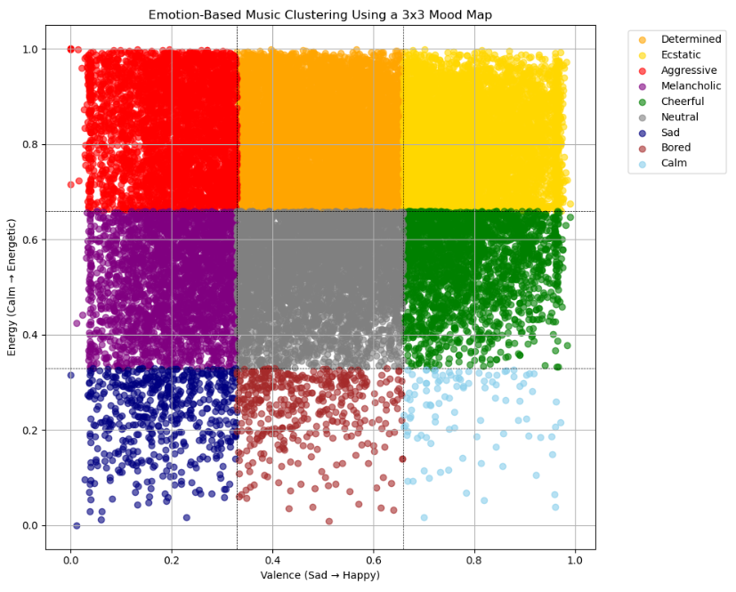

# Mood Prediction of Songs

122203088 Belinay Keleş  
121203034 Sude Şintürk  
121203079 Yeliz Avcı  
120203034 Sevgi Gündoğdu  

## 1.Scope of the Project

This project aims to measure whether it can accurately predict the emotional states conveyed by songs using multidimensional features. In addition to the Spotify dataset, album cover images and lyrics were used. The main goal of the project is to measure whether we can predict the emotion conveyed by a song by holistically analyzing audio-based (valence and energy), visual (album cover) and textual (lyrics) features using machine learning techniques. The project is based on the two-dimensional energy-valence matrix, which is widely used in psychology models such as Thayer's Mood Model to describe emotions. Songs are divided into emotional clusters such as energetic, sad, calm, stressed. The main focuses of the project are:  

-Performing textual analysis (NLP) on lyrics to identify emotional expressions and integrate them into the model,  
-Using visual processing techniques to analyze album cover features and use them for emotion prediction,  
-Determining the emotional position of songs on the mood map using audio-based features taken from Spotify.  

The ultimate goal of this project is to create an innovative machine learning-powered emotion prediction system based on a multimodal approach.  

 
## 2.Research Questions

How accurately can a song's emotion be predicted based on its audio features, visual features, lyrics and genre?

To what extent do the visual features of album covers (e.g., color, contrast, visual density), song lyrics, audio features and genres align with the predicted emotional state?

Among various machine learning models (e.g., XGBoost, Random Forest, SVM), which algorithm performs best in predicting a song’s emotion?

## 3.Preprocessing Steps

### 3.1.Libraries
In this project, the libraries OpenCV,  pandas, matploblib, seaborn, Pillow, io,  tqdm, NumPy, selenium, Spotipy, os, AutoTokenizer, google.generativeai, SentenceTransformer and scikit-learn were used.
In the parts where data is generated, the additional libraries selenium, time, requests, and beautifulsoup4 were used.
Additionally, the libraries xgboost, catboost, and scipy were used for model training and hyperparameter optimization.The components ConfusionMatrixDisplay, StratifiedKFold, and GridSearchCV from the scikit-learn library were also utilized in this project.

### 3.2.Dataset
To investigate the emotional prediction capability of energy and valence values, and assess the alignment of visual and lyrical features with emotional states, we enriched the original 30,000-track Spotify dataset with multi-modal content.

-Audio Features: The dataset includes core attributes like danceability, energy, valence, tempo, and others, directly retrieved via 30,000-track Spotify dataset.

-Album Covers: Using track_album_id, 22,533 unique album images were downloaded and later processed for visual features (e.g., average color, HSV, edge complexity, face presence, colorfulness, dominant color). The colorfulness metric, adapted from Hasler and Süsstrunk’s method, quantifies the perceptual diversity and intensity of colors using red-green and yellow-blue channel statistics. The edge complexity metric, inspired by Roboflow (2022), was computed by converting images to grayscale, applying the Canny edge detection algorithm, and calculating the ratio of edge pixels to total pixels to quantify visual detail.

-Lyrics: Lyrics were scraped from Genius.com using Selenium, matched by track title and artist. Tracks without lyrics were excluded. Token counts were calculated, and long lyrics were summarized using Gemini-1.5-Flash to fit the input size limits of the embedding model all-MiniLM-L6-v2.

-Lyrics Embeddings: Summarized lyrics were embedded into 384-dimensional vectors to represent emotional and semantic content for mood prediction and alignment analysis.

### 3.3.Process
Data Loading and Initial Cleaning  

The data processing pipeline consisted of five key stages: cleaning, labeling, transformation, feature extraction, and merging.
Data Cleaning: The initial dataset (spotify_songs.csv) was loaded and cleaned by removing missing values, outliers (e.g., loudness values outside -60 to 0 dB), and duplicate track entries to ensure data quality.

Mood Label Assignment: Based on Robert Thayer’s two-dimensional mood model, songs were categorized into four mood clusters. Following the methodology of Lata (2024), both axes were divided into two intervals, resulting in a 2x2 grid of emotional states. This produced four distinct mood labels such as Energetic, Stressed, Sad, and Calm, representing core affective combinations. A custom assign_thayer_mood function was implemented to assign each track to one of these categories, forming the foundation for evaluating the relationship between audio features and emotional perception.
  

 
One-Hot Encoding  

The categorical feature playlist_subgenre was transformed using one-hot encoding to create binary columns for each genre, enabling it to be used in machine learning models.  

Embedding

After the summarization process, a new column called lyrics_summary was created and the summaries were saved. Token counts for the summaries were then calculated and stored in the sum_token_count column. A statistical analysis using describe() revealed a median token count of 60.
At this point, the dataset was ready for embedding. Using the “all-MiniLM-L6-v2” model and the sentence-transformers library, a total of 19,457 lyric summaries were successfully embedded, each represented as a vector of length 384.The resulting embeddings were saved in a folder named “lyrics_embeddings.csv”.

Album Cover Features

In this project, features that convey the emotional characteristics of images were examined. The selected features include average color, dominant color, edge complexity, face presence, average HSV values, and colorfulness. 

To calculate the average color, each image was read using OpenCV, and the mean value of all pixel intensities was computed separately for each RGB channel. 

The edge complexity metric reflects how visually complex an image is. After converting the image to grayscale, the Canny edge detection algorithm was applied to detect edges. The ratio of edge pixels to total pixels was then calculated to quantify the level of visual detail (Roboflow, 2022). 

The has face feature identifies whether the image contains a human face. This was determined using the Haar Cascade face detection algorithm available in OpenCV. If a face was detected, the feature was recorded as 1; otherwise, 0. 

Another important metric is the HSV (Hue, Saturation, Value) representation, which describes color more similarly to human perception than the RGB color space.

Hue (H) indicates the color tone and ranges from 0 to 179 in OpenCV.

Saturation (S) represents the intensity of the color and ranges from 0 to 255.

Value (V) measures the brightness of the image, also ranging from 0 to 255. RGB images were converted to HSV using OpenCV, and the average of each channel was computed and then normalized to the [0, 1] range.

The colorfulness metric represents the diversity and intensity of the colors in the image. This feature was computed based on the formula proposed by Hasler and Süsstrunk in their paper "Measuring Colourfulness in Natural Images". The method involves calculating the mean and standard deviation of the red-green and yellow-blue opponent color channels and combining them to obtain a perceptual measure of colorfulness. Higher values indicate more vibrant and emotionally stimulating images.

To determine the dominant color, the most frequently occurring color cluster in the image was extracted using the KMeans clustering algorithm. All pixels were grouped into a predefined number of clusters, and the centroid of the largest cluster was used to represent the dominant RGB value of the image.

Dataset Merging and Final Dataset

At this stage, album cover features and features extracted from lyrics were added to the main DataFrame. The album cover features were merged using track_album_id, while the lyrics features were merged using track_id. As a result of this process, entries with missing feature values (NaNs) were removed, unwanted features were dropped from the DataFrame, and the dataset was prepared for training. The DataFrame was saved as final_dataset.csv.

### 3.4 Data Analysis  

    

This histogram illustrates the distribution of valence values among Spotify tracks. Valence measures the degree to which a track evokes positive emotions, with values ranging from 0 (very sad or negative) to 1 (very happy or positive). The valence values were divided into 30 equal-width bins after removing missing data. Each bar in the histogram indicates the number of tracks that fall within a given valence interval, offering a clear view of the emotional spread of the dataset.

  

This histogram displays the distribution of energy levels among Spotify tracks. The energy attribute represents a track’s overall intensity and tempo, with scores normalized between 0 (very low energy) and 1 (very high energy). The data were grouped into 30 bins. Each bar in the histogram represents the frequency of songs within a specific energy range, providing insights into how energetic the dataset is overall.  

  

This bar chart illustrates the distribution of Spotify tracks according to their assigned mood labels, derived from Thayer’s two-dimensional emotion model. The classification incorporates the dimensions of energy and valence to assign each track a specific emotional category. The observed distribution indicates that the dataset predominantly comprises songs characterized by high energy levels and emotionally positive or determined moods. This visualization facilitates a broader understanding of the emotional landscape of the dataset and highlights the prevalence of certain affective states in contemporary music content.  

  

This visualization is based on a 3x3 mood map created using the valence and energy values of songs. The main goal is to determine which mood each song reflects based on these two features and to present the emotional distribution of music in a visual format. Songs are visualized on a scatter plot, colored according to their assigned mood categories. Dashed lines at the 0.33 and 0.66 threshold values indicate the boundaries between mood regions. This study aims to understand which emotions music tracks correspond to.  

  

To better understand the relationships between key audio features in the dataset, a correlation matrix was computed and visualized using a heatmap. A Pearson correlation was calculated between continuous numerical features such as valence, energy, danceability, acousticness, instrumentalness, loudness and tempo. The correlation matrix helped identify which features moved together and which were potentially redundant or inversely related. The resulting matrix was visualized as a Seaborn heatmap, where strong positive correlations are shown in darker shades and strong negative correlations appear as lighter or blue-toned values. Also, annotations were added to each cell to indicate exact correlation coefficients.  

  

This bar chart illustrates the average valence and energy scores for different music genres. Each genre is represented by two bars: one for mean valence and one for mean energy.  

  

This bar chart presents the distribution of songs across Low, Medium, and High categories for both energy and valence.  

  

This boxplot visualizes the distribution of the energy and valence variables across different musical subgenres of Spotify tracks. The purpose of this visualization is to explore the variation in emotional and energetic attributes based on musical subcategory, allowing for comparative insights into how energy and mood positivity levels differ across subgenres.

### References

Hasler, David, and Sabine E. Suesstrunk. "Measuring colorfulness in natural images." Human vision and electronic imaging VIII. Vol. 5007. SPIE, 2003.

Kumar, P. L. (n.d.). Clustering Spotify Songs into Moods Using Thayer’s Model with a Mood Prediction and Enhancer Recommender System (Master’s dissertation, The University of Sheffield). Retrieved May 8, 2025, from   
https://papers.ssrn.com/sol3/papers.cfm?abstract_id=4969823

Roboflow. (2022, November 3). Edge detection in image processing: An introduction [Blog post]. Roboflow. https://blog.roboflow.com/edge-detection/

