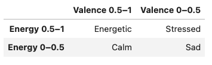
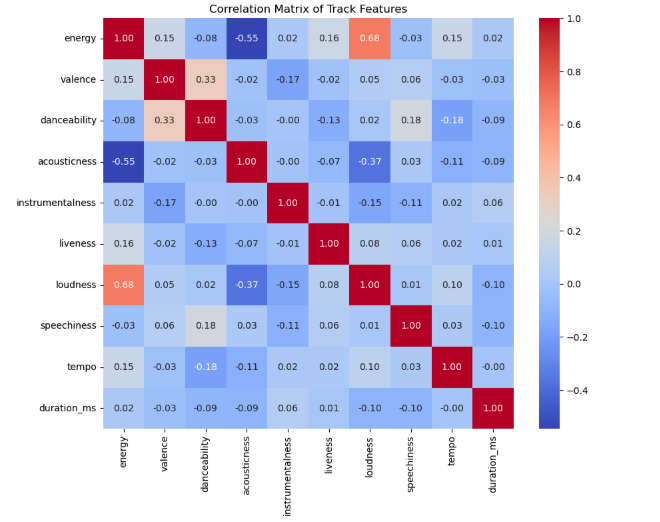
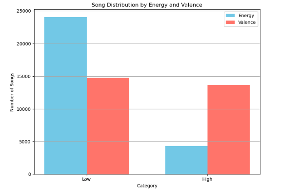
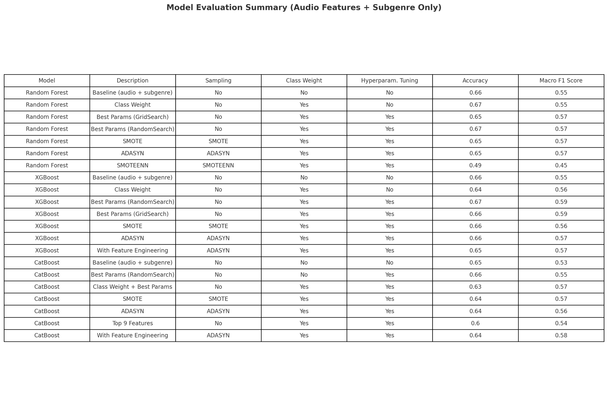
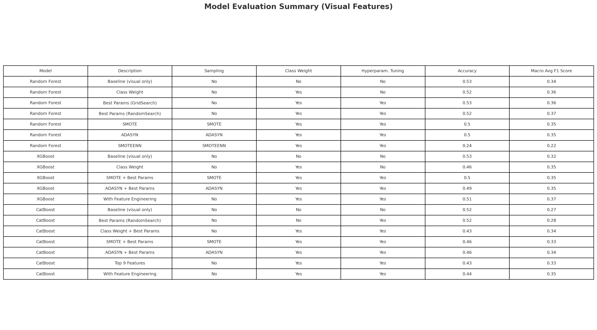
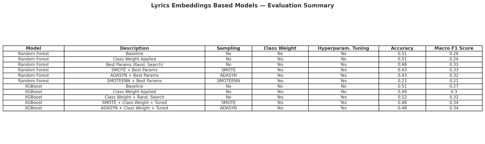

# Mood Prediction of Songs

122203088 Belinay Keleş  
121203034 Sude Şintürk  
121203079 Yeliz Avcı  
120203034 Sevgi Gündoğdu  

## 1.Scope of the Project

This project aims to measure whether it can accurately predict the emotional states conveyed by songs using multidimensional features. In addition to the Spotify dataset, album cover images and lyrics were used. The main goal of the project is to measure whether we can predict the emotion conveyed by a song by holistically analyzing audio-based , visual (album cover) and textual (lyrics) features using machine learning techniques. The project is based on the two-dimensional energy-valence matrix, which is Thayer's Mood Model to describe emotions. Songs are divided into emotional clusters such as energetic, sad, calm, stressed. The main focuses of the project are:  

-Performing textual analysis (NLP) on lyrics to identify emotional expressions and integrate them into the model,  
-Using visual processing techniques to analyze album cover features and use them for emotion prediction,  
-Determining the emotional position of songs on the mood map using audio-based features taken from Spotify.  
  

 
## 2.Research Questions

How accurately can a song's emotion be predicted based on its audio features, visual features, lyrics and genre?

To what extent do the visual features of album covers (e.g., color, contrast, visual density), song lyrics, audio features and genres align with the predicted emotional state?

Among various machine learning models (e.g., XGBoost, Random Forest, SVM), which algorithm performs best in predicting a song’s emotion?

## 3.Preprocessing Steps

### 3.1.Libraries
In this project, the libraries OpenCV,  pandas, matploblib, seaborn, Pillow, io,  tqdm, NumPy, selenium, Spotipy, os, AutoTokenizer, google.generativeai, SentenceTransformer and scikit-learn were used.
In the parts where data is generated, the additional libraries selenium, time, requests, and beautifulsoup4 were used.
Additionally, the libraries xgboost, catboost, and scipy were used for model training and hyperparameter optimization.The components ConfusionMatrixDisplay, StratifiedKFold, and GridSearchCV from the scikit-learn library were also utilized in this project.

### 3.2.Dataset
To investigate the emotional prediction capability of energy and valence values, and assess the alignment of visual and lyrical features with emotional states, we enriched the original 30,000-track Spotify dataset with multi-modal content.

**Audio Features:** The dataset includes core attributes like danceability, energy, valence, tempo, and others, directly retrieved via 30,000-track Spotify dataset.

**Album Covers:** Using track_album_id, 22,533 unique album images were downloaded and later processed for visual features (e.g., average color, HSV, edge complexity, face presence, colorfulness, dominant color). The colorfulness metric, adapted from Hasler and Süsstrunk’s method, quantifies the perceptual diversity and intensity of colors using red-green and yellow-blue channel statistics. The edge complexity metric, inspired by Roboflow (2022), was computed by converting images to grayscale, applying the Canny edge detection algorithm, and calculating the ratio of edge pixels to total pixels to quantify visual detail.

**Lyrics:** Lyrics were scraped from Genius.com using Selenium, matched by track title and artist. Tracks without lyrics were excluded. Token counts were calculated, and long lyrics were summarized using Gemini-1.5-Flash to fit the input size limits of the embedding model all-MiniLM-L6-v2.

**Lyrics Embeddings:** Summarized lyrics were embedded into 384-dimensional vectors to represent emotional and semantic content for mood prediction and alignment analysis.

### 3.3.Process

The data processing pipeline consisted of five key stages: cleaning, labeling, transformation, feature extraction, and merging.

**Data Cleaning:** The initial dataset (spotify_songs.csv) was loaded and cleaned by removing missing values, outliers (e.g., loudness values outside -60 to 0 dB), and duplicate track entries to ensure data quality.

**Mood Label Assignment:** Based on Robert Thayer’s two-dimensional mood model, songs were categorized into four mood clusters. Following the methodology of Lata (2024), both axes were divided into two intervals, resulting in a 2x2 grid of emotional states. This produced four distinct mood labels such as Energetic, Stressed, Sad, and Calm, representing core affective combinations. A custom assign_thayer_mood function was implemented to assign each track to one of these categories, forming the foundation for evaluating the relationship between audio features and emotional perception.
  

 
**One-Hot Encoding:** The categorical variable playlist_subgenre was converted into binary features using one-hot encoding to make it suitable for machine learning models.

**Merging and Final Dataset:** All features—audio, visual, and textual—were merged into a unified DataFrame using track_id and track_album_id. Rows with missing merged features were removed, and the final dataset was saved as final_dataset.csv for model training.

### 3.4 Data Analysis

This correlation matrix illustrates the relationships between track features. A strong positive correlation is observed between energy and loudness (0.68), indicating that higher energy levels are generally associated with higher loudness.

This chart displays the distribution of songs by low and high energy/valence levels. It shows that low-energy songs significantly outnumber high-energy ones in the dataset.

## 4. Model Selection, Sampling Strategies, and Fusion Architecture

To evaluate the emotional predictability of music, we employed a multimodal classification pipeline incorporating audio-genre features, visual album attributes, and embedded lyrics summaries. Our modeling strategy focused not only on maximizing classification accuracy, but also on exploring class imbalance, sampling diversity, and late fusion architectures, inspired by recent advances in multimodal learning and ensemble methods (Baltrušaitis et al., 2019; Francesconi et al., 2025).

### 4.1 Model Evaluation: Audio Features + Genre Only

In this phase of the project, we focused exclusively on audio-based features (such as energy, valence, danceability, tempo, etc.) and playlist_subgenre variables to assess how well emotions can be predicted from sound characteristics alone. The goal was to establish a strong unimodal performance benchmark before proceeding with multimodal learning.

To handle class imbalance—especially to better capture underrepresented emotional states like Calm—we applied various oversampling techniques such as SMOTE, ADASYN, and SMOTEENN, as recommended in Han et al. (2022), who highlighted their effectiveness in multi-class imbalanced datasets. We also experimented with class weight adjustments, feature engineering (e.g., selecting the top 9 most important features and creating new features by combining audio attributes), and hyperparameter optimization via RandomizedSearchCV and GridSearchCV.

Random Forest, XGBoost, and CatBoost classification models were evaluated. Each model underwent extensive experimentation under different configurations, including combinations of sampling strategies, class weights, and parameter tuning. A key goal was not just to maximize overall accuracy, but to specifically improve the macro-average F1-score, which is more sensitive to minority classes. This process was guided by research on imbalanced learning (Han et al., 2022) and ensemble techniques. The table below summarizes the most important experiments and results:

Through more than 20+ model configurations, we observed that XGBoost with RandomizedSearchCV tuning and class weight adjustment yielded the highest macro-average F1-score (0.59) while maintaining strong accuracy (0.67). CatBoost and Random Forest also showed competitive performance under certain sampling strategies. This process demonstrated the importance of class rebalancing and parameter optimization even in unimodal settings.

### 4.2 Model Evaluation: Visual Features Only

In this phase of the project, we investigated to what extent emotions can be classified using only visual features (e.g., average color values, brightness, saturation, face presence, edge density). The aim was to establish a strong unimodal, image-based baseline before moving on to multimodal models.

Various oversampling techniques (SMOTE, ADASYN, SMOTEENN) were applied to eliminate class imbalance and improve performance—especially in terms of macro-average F1-score, reflecting the overall ability to capture minority classes (Han et al., 2022). Each method was tested independently under multiple configurations. Additionally, class weight adjustments and hyperparameter optimization were performed via GridSearchCV and RandomizedSearchCV, allowing us to identify optimal model configurations and evaluate whether fine-tuning contributes meaningfully to accuracy and generalizability. Performance was further enhanced through feature selection (top 9 visual features) and feature engineering, such as combining HSV and colorfulness features to enhance emotional representation.

Random Forest, XGBoost, and CatBoost models were repeatedly trained under a wide range of configurations. Each was evaluated in terms of accuracy and macro-average F1-score. Special attention was given to improving underrepresented classes and evaluating the contribution of balancing strategies and parameter tuning.

Across 19 different model configurations, significant insights were gained. The highest macro-average F1-score (0.37) was achieved using XGBoost with engineered visual features, emphasizing the power of thoughtful feature design. The highest overall accuracy (0.53) was observed in a baseline Random Forest configuration without any class balancing or tuning, but its macro F1-score was lower (0.34), underscoring the necessity of balancing strategies for holistic model success.

### 4.3 Model Evaluation: Lyrics Embeddings Only

In this phase of the project, only lyrics embeddings were used to examine the extent to which emotional classification could be achieved through textual features alone. Two main classifiers, Random Forest and XGBoost, were iteratively trained under various configurations to improve performance, particularly in addressing class imbalance and boosting macro-average F1 scores.

For Random Forest, six different configurations were explored. Initially, the model was trained without any intervention, achieving a macro F1 score of 0.26. Subsequent experiments involved the application of class weights, RandomizedSearchCV for hyperparameter optimization, and oversampling techniques including SMOTE, ADASYN, and SMOTEENN. The best result was achieved using RandomSearchCV combined with class weighting.

For XGBoost, six variants were also tested. Starting from a baseline which is a macro F1 score of 0.26, improvements were observed by incorporating class weights, RandomizedSearchCV, and oversampling techniques. The most successful configuration is when class weight and hyperparameter tuning is used together, demonstrating the importance of both class weights and parameter tuning for handling imbalanced data in textual emotion classification.

### References

Baltrušaitis, T., Ahuja, C., & Morency, L.-P. (2019). Multimodal machine learning: A survey and taxonomy. IEEE Transactions on Pattern Analysis and Machine Intelligence, 41(2), 423–443. https://doi.org/10.1109/TPAMI.2018.2798607

Francesconi, A., Di Biase, L., Cappetta, D., Di Gregorio, M., & De Momi, E. (2025). Class balancing diversity multimodal ensemble for Alzheimer’s disease diagnosis and early detection. Computerized Medical Imaging and Graphics, 123, 102529. https://doi.org/10.1016/j.compmedimag.2025.102529

Han, M., Li, A., Gao, Z., & Zhang, J. (2022). A survey of multi-class imbalanced data classification methods. Journal of Intelligent & Fuzzy Systems, 44(6), 2471–2501. https://doi.org/10.3233/JIFS-221902

Hasler, David, and Sabine E. Suesstrunk. "Measuring colorfulness in natural images." Human vision and electronic imaging VIII. Vol. 5007. SPIE, 2003.

Kumar, P. L. (n.d.). Clustering Spotify Songs into Moods Using Thayer’s Model with a Mood Prediction and Enhancer Recommender System (Master’s dissertation, The University of Sheffield). Retrieved May 8, 2025, from   
https://papers.ssrn.com/sol3/papers.cfm?abstract_id=4969823

Roboflow. (2022, November 3). Edge detection in image processing: An introduction [Blog post]. Roboflow. https://blog.roboflow.com/edge-detection/

